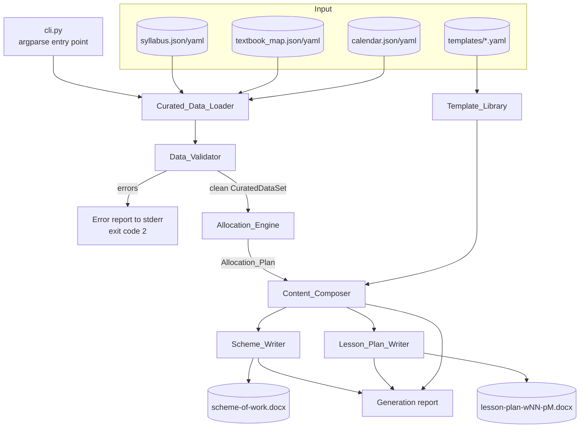

# Design Document

## Overview

The Generator is a single-process, offline command line application that turns three hand-curated data files into a Form 1 Mathematics scheme of work `.docx` and a set of lesson plan `.docx` documents. It is a straight pipeline with no persistent state, no services, and no network use:

```
Curated_Data_Files -> Curated_Data_Loader -> Data_Validator -> Allocation_Engine -> Content_Composer -> Scheme_Writer / Lesson_Plan_Writer -> .docx + generation report
```

Every stage is a pure function of its inputs except the two writers and the report emitter, which perform file system writes. All ordering is derived from explicit keys in the curated data, and all dates come from `Calendar_Data`, never from the system clock.

### Runtime and library choices

**Python 3.11 on CPython, standard library plus three pinned dependencies.**

| Concern | Choice | Why |
| --- | --- | --- |
| Runtime | Python 3.11 | Greenfield workspace, no existing stack to match. The only mature, permissively licensed `.docx` writer that produces real Office Open XML with editable tables is `python-docx`, which fixes the language. Python also ships `zipfile`, `datetime`, and `json` in the standard library, which covers deterministic packaging and date arithmetic with no extra dependencies. |
| `.docx` rendering | `python-docx==1.1.2` | Writes genuine OOXML packages (not HTML-in-a-zip, not RTF), supports tables with per-cell paragraph runs, cell merging, column widths, and page setup. Output opens in Word, LibreOffice, and Google Docs with editable text and editable table cells, which Requirement 8.4 needs. It has no network or native dependencies. |
| Schema declaration and validation | `pydantic==2.9.2` | Requirement 1.1 needs a declared schema with field name, type, and required flag; Requirements 2.2 and 2.3 need errors that name the file path, the field path, the declared type, and the received type. Pydantic v2 models are exactly that declaration, and `ValidationError.errors()` yields `loc` (field path), `type`, and `input` (received value) for **every** failure in one pass, which is what the aggregated reporting in Requirement 2.10 requires. Hand-rolling this would be several hundred lines of error-path plumbing for no gain. |
| YAML parsing | `PyYAML==6.0.2` (`yaml.safe_load` only) | Requirement 1.7 allows JSON or YAML. `safe_load` refuses arbitrary object construction, and its `MarkedYAMLError` carries line and column for the parse position in Requirement 1.9. JSON is handled by the standard library, whose `JSONDecodeError` carries `lineno`/`colno`. |
| CLI | `argparse` (standard library) | Three subcommands and a dozen flags do not justify a dependency. |
| Tests | `pytest==8.3.3` + `hypothesis==6.112.1` | Hypothesis supplies the generators for the property tests in the Correctness Properties section. |

No HTTP client, no LLM SDK, and no cloud SDK appears anywhere in the dependency manifest. That absence is asserted by a test (see Testing Strategy).

### Design principles

1. **Data over code.** Subject, form, academic year, topic order, period counts, calendar shape, and template text all live in data files. The only subject-specific thing in the source tree is the shipped dataset under `data/form1-mathematics/`.
2. **Fail before writing.** Loading and validation complete for all three files, and allocation completes in memory, before any writer touches the output directory. A run either writes a complete set of documents or writes nothing.
3. **Aggregate, do not abort.** Validation collects every `Validation_Error` it can find, then reports them together. Only unparseable files short-circuit, because there is nothing to validate.
4. **Explicit keys everywhere.** No stage relies on dictionary insertion order, file system enumeration order, or set iteration order. Sorting keys are named in the design and carried in the data.

---

## Architecture

### Component diagram



### Data flow, stage by stage

| Stage | Input | Output | Side effects |
| --- | --- | --- | --- |
| `Curated_Data_Loader` | Three file paths | `CuratedDataSet` (validated models) or `list[ValidationError]` | Reads files |
| `Data_Validator` | `CuratedDataSet` | `list[ValidationError]` (empty on success) | None |
| `Allocation_Engine` | `SyllabusData`, `CalendarData` | `AllocationPlan` or `list[ValidationError]` | None |
| `Content_Composer` | `TemplateLibrary`, assignment context | Composed text fields, substitution records | None |
| `Scheme_Writer` | `AllocationPlan`, `CuratedDataSet`, `Content_Composer` | `.docx` path, row count | Writes file |
| `Lesson_Plan_Writer` | `AllocationPlan`, `CuratedDataSet`, `Content_Composer`, week/period request | `.docx` paths | Writes files |
| `ReportEmitter` | Writer results, substitution records | `generation-report.json` / stdout summary | Writes file |

The loader performs schema validation as a side effect of model construction (pydantic), so schema-level errors from Requirements 2.2, 2.3, 1.6, and the enum domains surface during loading. The `Data_Validator` handles everything pydantic cannot express in a single model: cross-file referential integrity, duplicate identifiers, capacity arithmetic, and range invariants. Both error sources feed a single aggregated report, so the split is invisible to the user.

---

## Curated Data Schema

Three files, one schema each. All three are accepted as either `.json` or `.yaml`/`.yml`; the loader dispatches on file extension and both encodings produce identical in-memory records.

### Common conventions

- Identifiers are non-empty strings matching `^[A-Za-z0-9][A-Za-z0-9._-]*$`.
- Dates are ISO 8601 calendar dates (`YYYY-MM-DD`), parsed to `datetime.date`.
- Every ordered collection carries an explicit integer `order` field. The loader sorts by `order`, so the physical order of records in the file is irrelevant (Requirement 7.6).
- `schema_version` is a required top-level string on each file, currently `"1.0"`. It lets a later version of the Generator refuse data it does not understand.

### Syllabus_Data

```
SyllabusData
  schema_version: str            required
  subject:        str            required   # e.g. "Mathematics" - data, not code (Req 9.1)
  form:           str            required   # e.g. "Form 1"
  source_note:    str            optional   # provenance note for the human curator
  topics:         list[Topic]    required, min length 1

Topic
  order:      int              required, >= 1, unique within topics
  topic_id:   str              required, identifier, globally unique
  title:      str              required, non-empty
  sub_topics: list[SubTopic]   required, min length 1

SubTopic
  order:         int         required, >= 1, unique within the parent topic
  sub_topic_id:  str         required, identifier, globally unique
  title:         str         required, non-empty
  objectives:    list[Objective]  required, min length 1
  competences:   list[str]   required, min length 1        (Req 1.3)
  planned_periods: int       required, >= 1                (Req 1.3)
  template_hint: str         optional   # explicit Template_Library selection key

Objective
  order: int  required, >= 1, unique within the parent sub-topic
  text:  str  required, non-empty
```

Example fragment:

```json
{
  "schema_version": "1.0",
  "subject": "Mathematics",
  "form": "Form 1",
  "topics": [
    {
      "order": 1,
      "topic_id": "T01",
      "title": "Numbers",
      "sub_topics": [
        {
          "order": 1,
          "sub_topic_id": "T01.S01",
          "title": "Natural and whole numbers",
          "competences": [
            "Count, read and write natural and whole numbers in words and figures"
          ],
          "planned_periods": 6,
          "objectives": [
            { "order": 1, "text": "Identify natural and whole numbers on a number line" },
            { "order": 2, "text": "Read and write numbers in words and in figures" },
            { "order": 3, "text": "Round off whole numbers to a given place value" }
          ]
        },
        {
          "order": 2,
          "sub_topic_id": "T01.S02",
          "title": "Operations with whole numbers",
          "competences": ["Apply the four basic operations to solve daily-life problems"],
          "planned_periods": 8,
          "objectives": [
            { "order": 1, "text": "Add and subtract whole numbers" },
            { "order": 2, "text": "Multiply and divide whole numbers" },
            { "order": 3, "text": "Apply the order of operations to mixed expressions" }
          ]
        }
      ]
    }
  ]
}
```

### Textbook_Map

```
TextbookMap
  schema_version: str                  required
  entries:        list[TextbookEntry]  required, min length 1

TextbookEntry
  sub_topic_id: str  required, identifier, unique within entries
  book_title:   str  required, non-empty
  start_page:   int  required, >= 1
  end_page:     int  required, >= 1        (end_page >= start_page checked by Data_Validator, Req 2.9)
  note:         str  optional             # e.g. "Exercise 1.3"
```

Example fragment:

```yaml
schema_version: "1.0"
entries:
  - sub_topic_id: "T01.S01"
    book_title: "Mathematics for Secondary Schools, Form 1"
    start_page: 1
    end_page: 12
  - sub_topic_id: "T01.S02"
    book_title: "Mathematics for Secondary Schools, Form 1"
    start_page: 13
    end_page: 28
    note: "Exercises 1.4 - 1.7"
```

### Calendar_Data

```
CalendarData
  schema_version: str          required
  academic_year:  str          required   # e.g. "2026"
  terms:          list[Term]   required, min length 1

Term
  order:   int          required, >= 1, unique within terms
  term_id: str          required, identifier, globally unique
  title:   str          required, non-empty      # e.g. "Term I"
  weeks:   list[Week]   required, min length 1

Week
  week_number:    int    required, >= 1, unique across the whole calendar
  start_date:     date   required
  end_date:       date   required              (end_date >= start_date checked by Data_Validator, Req 2.8)
  classification: enum   required, one of "teaching" | "holiday" | "examination"
  period_budget:  int    required when classification == "teaching", >= 0   (Req 1.6)
                         must be absent or 0 for other classifications
  period_days:    list[int]  optional   # day offsets from start_date, one per period
  label:          str    optional       # e.g. "Mid-term break", printed in Remarks-adjacent contexts
```

`period_days` is the optional refinement of the date rule in Requirement 5.5. When present it must have exactly `period_budget` entries, each a non-negative offset less than `(end_date - start_date).days + 1`, and it must be strictly increasing. When absent, the declared default applies: period *n* falls on `start_date + (n - 1) days`, and the validator requires `period_budget <= (end_date - start_date).days + 1` so the default never leaves the week.

Example fragment:

```json
{
  "schema_version": "1.0",
  "academic_year": "2026",
  "terms": [
    {
      "order": 1,
      "term_id": "TERM1",
      "title": "Term I",
      "weeks": [
        { "week_number": 1, "start_date": "2026-01-12", "end_date": "2026-01-16",
          "classification": "teaching", "period_budget": 5,
          "period_days": [0, 1, 2, 3, 4] },
        { "week_number": 2, "start_date": "2026-01-19", "end_date": "2026-01-23",
          "classification": "teaching", "period_budget": 5 },
        { "week_number": 9, "start_date": "2026-03-09", "end_date": "2026-03-13",
          "classification": "examination", "label": "Mid-term examinations" },
        { "week_number": 10, "start_date": "2026-03-16", "end_date": "2026-03-20",
          "classification": "holiday", "label": "Mid-term break" }
      ]
    }
  ]
}
```

### Schema declaration surface (Requirement 1.1)

Each model exposes a machine-readable declaration derived from the pydantic model, so the schema is documentation and validation at once:

```python
def describe_schema(model: type[BaseModel]) -> list[FieldSpec]:
    """FieldSpec(path, declared_type, required, constraints) for every field, depth-first."""
```

`sowgen schema` prints this table for all three files. This is the artifact Requirement 1.1 calls for, and it cannot drift from the validator because it is generated from the same models.

---

## Data Models

### In-memory records

Loaded models are frozen pydantic models (`model_config = ConfigDict(frozen=True)`), so no stage can mutate shared input. The loader wraps them:

```python
@dataclass(frozen=True)
class CuratedDataSet:
    syllabus: SyllabusData
    textbook_map: TextbookMap
    calendar: CalendarData
    paths: DataPaths                     # for error messages

    # Derived indexes, built once, deterministic
    sub_topics_in_order: tuple[SubTopicRef, ...]     # sorted by (topic.order, sub_topic.order)
    sub_topic_by_id: Mapping[str, SubTopicRef]
    textbook_by_sub_topic: Mapping[str, TextbookEntry]
    teaching_weeks_in_order: tuple[WeekRef, ...]     # sorted by (term.order, week.week_number)
    week_by_number: Mapping[int, WeekRef]

@dataclass(frozen=True)
class SubTopicRef:
    topic: Topic
    sub_topic: SubTopic
    global_index: int          # position in sub_topics_in_order

@dataclass(frozen=True)
class WeekRef:
    term: Term
    week: Week
```

### Allocation_Plan

The plan is the contract between allocation and both writers. It carries enough information to render a scheme row and to resolve a `(week_number, period_number)` request to a single assignment.

```python
@dataclass(frozen=True)
class Assignment:
    term_id: str
    term_order: int
    term_title: str
    week_number: int
    slot: int                  # 1-based position of this assignment within its week
    first_period: int          # 1-based period index within the week, inclusive
    last_period: int           # inclusive; periods == last_period - first_period + 1
    periods: int
    topic_id: str
    topic_title: str
    sub_topic_id: str
    sub_topic_title: str
    objectives: tuple[str, ...]        # objective texts in declared order (Req 3.6)
    competences: tuple[str, ...]
    split_index: int           # 1-based part number when a sub-topic spans weeks
    split_total: int           # total number of parts; 1 when not split

@dataclass(frozen=True)
class WeekAllocation:
    term_id: str
    term_order: int
    week_number: int
    start_date: date
    end_date: date
    period_budget: int
    periods_assigned: int
    assignments: tuple[Assignment, ...]        # ordered by slot
    period_dates: tuple[date, ...]             # index n-1 -> date of period n

@dataclass(frozen=True)
class AllocationPlan:
    academic_year: str
    subject: str
    form: str
    weeks: tuple[WeekAllocation, ...]          # ordered by (term_order, week_number)

    def assignment_for(self, week_number: int, period_number: int) -> Assignment: ...
    def all_assignments(self) -> Iterator[Assignment]: ...      # scheme row order
```

`assignment_for` is the resolver behind Requirement 5.3: it finds the week, then the assignment whose `first_period <= period_number <= last_period`. Because assignments within a week partition `1..periods_assigned` with no gaps and no overlaps, the lookup is total for every valid period.

### Validation_Error

```python
class Severity(StrEnum):
    ERROR = "error"

@dataclass(frozen=True)
class ValidationError:
    code: str                  # stable machine code, see table below
    file_path: str | None      # None for errors that are not file-scoped
    field_path: str | None     # dotted/indexed path, e.g. "topics[0].sub_topics[2].planned_periods"
    message: str               # human-readable, self-contained
    details: Mapping[str, str | int | None] = field(default_factory=dict)

    def sort_key(self) -> tuple:            # deterministic report ordering
        return (self.file_path or "", self.field_path or "", self.code)
```

Error codes and the requirement each serves:

| Code | Trigger | Details carried | Req |
| --- | --- | --- | --- |
| `FILE_NOT_FOUND` | Expected path absent | `expected_path` | 1.8 |
| `PARSE_ERROR` | JSON/YAML will not deserialise | `line`, `column`, `parser_message` | 1.9 |
| `UNSUPPORTED_FORMAT` | Extension is neither JSON nor YAML | `extension` | 1.7 |
| `MISSING_REQUIRED_FIELD` | Required field absent | `field_path` | 2.2 |
| `TYPE_MISMATCH` | Value of wrong type | `declared_type`, `received_type`, `received_value` | 2.3 |
| `CONSTRAINT_VIOLATION` | Domain rule (e.g. `planned_periods < 1`, negative budget, bad enum) | `constraint`, `received_value` | 1.3, 1.6, 1.5 |
| `DUPLICATE_ID` | Two topics or sub-topics share an id | `identifier`, `first_field_path`, `second_field_path` | 2.4 |
| `SUB_TOPIC_WITHOUT_TEXTBOOK_ENTRY` | Sub-topic missing from `Textbook_Map` | `sub_topic_id` | 2.5 |
| `TEXTBOOK_ENTRY_WITHOUT_SUB_TOPIC` | Orphan `Textbook_Map` entry | `sub_topic_id` | 2.6 |
| `CAPACITY_EXCEEDED` | Planned periods > available periods | `planned_total`, `available_total` | 2.7 |
| `INVERTED_WEEK_DATES` | `end_date < start_date` | `term_title`, `week_number`, `start_date`, `end_date` | 2.8 |
| `INVERTED_PAGE_RANGE` | `end_page < start_page` | `sub_topic_id`, `start_page`, `end_page` | 2.9 |
| `PERIOD_DAYS_INVALID` | `period_days` wrong length, not increasing, or outside the week | `week_number`, `period_budget` | 5.5 |
| `PERIODS_EXCEED_WEEK_LENGTH` | Default date rule would leave the week | `week_number`, `period_budget`, `week_days` | 5.5 |
| `UNASSIGNED_SUB_TOPICS` | Allocation ran out of teaching weeks | `sub_topic_ids`, `remaining_periods` | 3.7 |
| `WEEK_NOT_IN_PLAN` | Lesson plan request names an unknown week | `requested_week`, `min_week`, `max_week` | 5.8 |
| `PERIOD_NOT_IN_WEEK` | Lesson plan request exceeds the week's periods | `requested_period`, `assigned_periods`, `week_number` | 5.9 |
| `OUTPUT_NOT_WRITABLE` | Writer cannot create or replace a file | `output_path`, `os_error` | 4.11 |
| `OUTPUT_EXISTS` | Target exists and `--overwrite` not supplied | `output_path` | 8.3 |
| `OUTPUT_INSIDE_DATA_DIR` | Output directory overlaps a data file directory | `output_dir`, `data_dir` | 8.2 |

---

## Components and Interfaces

### Curated_Data_Loader

```python
class CuratedDataLoader:
    def load(self, paths: DataPaths) -> LoadResult:
        """Reads and deserialises all three files. Never raises for bad input."""

@dataclass(frozen=True)
class LoadResult:
    data: CuratedDataSet | None
    errors: tuple[ValidationError, ...]
```

Behaviour:

1. For each of the three paths: check existence (`FILE_NOT_FOUND` if absent), dispatch on extension (`.json` -> `json.loads`, `.yaml`/`.yml` -> `yaml.safe_load`, anything else -> `UNSUPPORTED_FORMAT`), and deserialise. `json.JSONDecodeError` and `yaml.MarkedYAMLError` both become `PARSE_ERROR` with line and column.
2. Files that deserialise are validated into pydantic models. `pydantic.ValidationError.errors()` is translated one entry per error: `loc` becomes the dotted `field_path`, `missing` becomes `MISSING_REQUIRED_FIELD`, `*_type` becomes `TYPE_MISMATCH` with `declared_type` from the model field annotation and `received_type` from `type(input).__name__`, and everything else becomes `CONSTRAINT_VIOLATION`.
3. All three files are attempted even if the first fails, so one run reports errors from every file (Requirement 2.10).
4. If every file loaded, derived indexes are built and `CuratedDataSet` is returned. Index construction sorts by explicit `order` keys, never by file order.
5. Loading is decoupled from reading so tests can drive it from in-memory strings: `load_from_documents(mapping_of_path_to_parsed_object)`.

### Data_Validator

```python
class DataValidator:
    def validate(self, data: CuratedDataSet) -> tuple[ValidationError, ...]:
        """Cross-file and cross-record rules. Returns every error found, sorted."""
```

Runs each rule independently and concatenates results, so one defect never hides another:

| Rule | Implementation sketch |
| --- | --- |
| Duplicate identifiers | Walk topics and sub-topics collecting `id -> [field_path]`; emit `DUPLICATE_ID` for any id with more than one path, naming the first two paths and counting the rest in `details`. |
| Referential integrity both ways | `syllabus_ids - textbook_ids` yields `SUB_TOPIC_WITHOUT_TEXTBOOK_ENTRY`; `textbook_ids - syllabus_ids` yields `TEXTBOOK_ENTRY_WITHOUT_SUB_TOPIC`. Both sets are iterated in sorted order for deterministic reports. |
| Capacity | `planned = sum(st.planned_periods)`, `available = sum(w.period_budget for teaching weeks)`; emit `CAPACITY_EXCEEDED` when `planned > available`, carrying both totals. |
| Inverted ranges | One pass over weeks for `INVERTED_WEEK_DATES`, one over textbook entries for `INVERTED_PAGE_RANGE`. |
| Period-day feasibility | `PERIOD_DAYS_INVALID` / `PERIODS_EXCEED_WEEK_LENGTH` per week as described in the calendar schema. |
| Non-teaching weeks with a budget | `CONSTRAINT_VIOLATION` when a holiday or examination week declares a non-zero `period_budget`, since that budget would be silently discarded. |

The orchestrator calls the `Allocation_Engine` only when validation returns an empty tuple (Requirement 2.1), and no writer is constructed until allocation succeeds (Requirement 2.10).

### Allocation_Engine

```python
class AllocationEngine:
    def allocate(self, data: CuratedDataSet) -> AllocationResult   # plan | errors
```

The engine reads only `sub_topics_in_order`, `teaching_weeks_in_order`, and each week's `period_budget`, `start_date`, `end_date`, and `period_days`. It never reads `subject` or `form` (Requirement 9.3) — those are copied into the plan by the orchestrator, not consulted by the packing loop.

**Algorithm** (greedy sequential bin packing with splitting, single pass, no backtracking):

```
weeks   := teaching_weeks_in_order            # holiday and examination weeks already filtered out (Req 3.2)
queue   := sub_topics_in_order                # syllabus order (Req 3.1)
w       := 0                                  # index into weeks
result  := []

for each sub_topic in queue:
    remaining_periods := sub_topic.planned_periods
    part              := 0
    parts_for_this_sub_topic := []

    while remaining_periods > 0:
        # skip weeks that are full or declare a zero budget
        while w < len(weeks) and capacity_left(weeks[w]) == 0:
            w := w + 1
        if w >= len(weeks):
            return errors: UNASSIGNED_SUB_TOPICS for this and every later sub_topic

        take := min(remaining_periods, capacity_left(weeks[w]))     # Req 3.3
        part := part + 1
        parts_for_this_sub_topic.append(
            draft_assignment(week=weeks[w], sub_topic=sub_topic, periods=take, part=part))
        remaining_periods := remaining_periods - take               # Req 3.4

    # after the loop the true split_total is known, so stamp it on every part
    for each draft in parts_for_this_sub_topic:
        draft.split_total := part
    result.extend(parts_for_this_sub_topic)

# Req 3.5 falls out of the loop: the week index only advances when capacity_left == 0,
# so a week with slack always receives the next sub-topic.
```

Then a finalisation pass groups drafts by week, assigns `slot` in insertion order, computes `first_period`/`last_period` as a running cursor within each week, resolves `period_dates` from `period_days` or the default offset rule, and freezes everything into `AllocationPlan`.

Properties the algorithm guarantees by construction:

- **Period conservation.** `take` is subtracted from `remaining_periods` on every iteration and the loop exits only at zero, so the periods recorded for a sub-topic sum exactly to `planned_periods`.
- **Capacity respect.** `take <= capacity_left(week)`, and `capacity_left` is recomputed from assignments already placed, so no week exceeds its budget.
- **Consecutive splits.** `w` never decreases, so the parts of one sub-topic occupy consecutive entries of `teaching_weeks_in_order`. Weeks with a zero budget are skipped, which means "consecutive teaching weeks with capacity" — a week declaring `period_budget: 0` is teaching-classified but cannot hold a period, so it is transparently passed over.
- **Tight packing.** A week is left with slack only when the queue is exhausted, so slack can appear in the last used week only.
- **Determinism.** No randomness, no hashing-order iteration, no clock. Identical input yields identical output (Requirement 3.8).

Failure mode: when weeks run out, the error lists the current sub-topic and every sub-topic still in the queue, plus the total unplaced periods. Note that Requirement 2.7 usually catches this earlier via the capacity sum, but 3.7 still fires when totals fit yet the per-week shape does not — for example a single sub-topic requiring more periods than all remaining weeks combined provide after earlier packing. Keeping both checks means the engine is safe to call directly in tests without the validator in front of it.

### Template_Library and Content_Composer

The `Template_Library` is a directory of YAML files, one per composed field. Each file declares a default template plus keyed overrides.

```
templates/
  teaching_learning_strategies.yaml
  teaching_learning_resources.yaml     # rendering hints only; the text comes from Textbook_Map
  assessment.yaml
  teacher_activities.yaml
  student_activities.yaml
  consolidation.yaml
  vocabulary.yaml                      # shared phrase lists referenced by name
```

File shape:

```yaml
field: teaching_learning_strategies
default:
  template: |
    Question and answer; guided discussion; demonstration on the chalkboard;
    individual and group exercises on {sub_topic_title}.
by_topic:
  T01:
    template: |
      Question and answer on number recognition; demonstration using a number line;
      group exercises on {sub_topic_title}; marking and correcting individual work.
by_sub_topic:
  T01.S02:
    template: |
      Demonstration of the four operations on the chalkboard; think-pair-share on
      word problems; individual exercises from {book_title}, pages {start_page}-{end_page}.
by_objective_verb:
  construct:
    template: |
      Teacher demonstration with a ruler, pair of compasses and protractor; learners
      practise the construction in pairs and check each other's work.
```

**Selection order** (most specific wins, Requirement 6.1):

1. `by_sub_topic[sub_topic.template_hint]` when `template_hint` is set — the explicit escape hatch for a curator who wants exact wording.
2. `by_sub_topic[sub_topic_id]`
3. `by_topic[topic_id]`
4. `by_objective_verb[v]` where `v` is the first verb, lower-cased, of the assignment's first objective in declared order. Using only the first objective keeps selection a pure function of an explicit order key rather than of set iteration.
5. `default` — and when this branch is taken, the composer appends a `TemplateSubstitution(field, selection_keys_tried, resolved="default")` record for the generation report (Requirement 6.5).

Interfaces:

```python
class TemplateLibrary:
    @classmethod
    def load(cls, directory: Path) -> "TemplateLibrary | list[ValidationError]": ...
    def resolve(self, field: str, keys: SelectionKeys) -> ResolvedTemplate: ...   # .template, .used_default

@dataclass(frozen=True)
class SelectionKeys:
    topic_id: str
    sub_topic_id: str
    template_hint: str | None
    objective_texts: tuple[str, ...]

class ContentComposer:
    def __init__(self, library: TemplateLibrary) -> None: ...       # only inputs: library + per-call data (Req 6.3)

    def compose(self, field: str, assignment: Assignment,
                textbook: TextbookEntry) -> str: ...
    @property
    def substitutions(self) -> tuple[TemplateSubstitution, ...]: ...
```

Rendering is `str.format_map` over a fixed, closed placeholder set — `topic_title`, `sub_topic_title`, `book_title`, `start_page`, `end_page`, `periods`, `objective_list`, `first_objective`, `competence`, `week_number`, `part_of` — with a mapping that raises a load-time error for unknown placeholders rather than a run-time surprise. Whitespace is normalised (collapse runs, strip) so YAML block scalars do not leak line breaks into table cells. Composition is a pure function of `(field, keys, data)` with no memo of prior calls affecting output, so identical keys give identical text (Requirement 6.4); the substitution list is append-only bookkeeping and does not influence returned text.

Requirement 6.2 is satisfied by authoring: the shipped templates are transcribed from `assets/sample/schemeOfWork/SCHEME-MATH F1 2026 - W.docx` and `assets/sample/lessonPlan/MATHEMATICS LESSON FI (1).docx`, keeping their verbs and phrasing ("question and answer", "guided discussion", "demonstration", "individual exercises", "marking and correcting"). Provenance is recorded in a `source:` comment at the head of each template file and checked at review time, since it is not machine-verifiable.

### Scheme_Writer

```python
class SchemeWriter:
    def write(self, plan: AllocationPlan, data: CuratedDataSet,
              composer: ContentComposer, output_path: Path,
              overwrite: bool) -> WriteResult      # path + row_count, or errors
```

Document structure:

1. **Heading block** (Requirement 4.10): three centred paragraphs — `SCHEME OF WORK`, `SUBJECT: {subject}    CLASS: {form}`, `ACADEMIC YEAR: {academic_year}` — all values from the plan, which carries them from the data files.
2. **Table**, landscape A4, one header row with exactly these columns left to right (Requirement 4.2):

   | # | Column | Source |
   | --- | --- | --- |
   | 1 | Week | `assignment.week_number` |
   | 2 | Periods | `assignment.periods` |
   | 3 | Topic/Sub-topic | `topic_title` + newline + `sub_topic_title` (+ ` (Part {split_index} of {split_total})` when split) |
   | 4 | Specific Objectives | one numbered paragraph per objective, in declared order |
   | 5 | Teaching/Learning Strategies | `composer.compose("teaching_learning_strategies", ...)` |
   | 6 | Teaching/Learning Resources | `{book_title}, pages {start_page}-{end_page}` from `Textbook_Map`, plus the resources template line |
   | 7 | Assessment | `composer.compose("assessment", ...)` |
   | 8 | Remarks | empty paragraph (Requirement 4.9) |

3. **Row order**: `plan.all_assignments()`, which yields `(term_order, week_number, slot)` ascending (Requirement 4.3). No term-separator rows are inserted, because Requirement 4.3 fixes the body row count at one row per assignment. Term identity is instead shown in the Week cell as `{term_title} W{week_number}` for the first row of each term and `W{week_number}` thereafter, and the heading block lists the terms with their week ranges.
4. **Formatting**: fixed column widths in EMU, header row bold with repeat-on-each-page enabled, `Table Grid` style so cell borders print, and 9pt body text to fit eight columns on one landscape page. All widths are constants in `scheme_layout.py`; no measurement or auto-fit, which keeps output stable.
5. **Writing**: build the document in memory, then hand it to the shared `atomic_write` helper (below).

### Lesson_Plan_Writer

```python
class LessonPlanWriter:
    def write_one(self, plan, data, composer, week_number: int, period_number: int,
                  output_dir: Path, overwrite: bool) -> WriteResult
    def write_week(self, plan, data, composer, week_number: int,
                   output_dir: Path, overwrite: bool) -> WriteResult   # Req 5.10
```

Request validation happens before any rendering: unknown week -> `WEEK_NOT_IN_PLAN` carrying the min and max week numbers in the plan (Requirement 5.8); period outside `1..periods_assigned` -> `PERIOD_NOT_IN_WEEK` carrying the requested number and the week's assigned count (Requirement 5.9). `write_week` resolves the week once, then writes exactly `periods_assigned` documents named `lesson-plan-w{week:02d}-p{period}.docx`, so filenames are distinct and sort naturally.

Document structure — a two-column label/value table for the header fields and labelled sections for the longer prose, matching the sample lesson plan layout. All eleven fields from Requirement 5.2 appear:

| Field | Source |
| --- | --- |
| Date | `week.period_dates[period_number - 1]`, formatted `DD/MM/YYYY` (Requirement 5.5) |
| Subject | `plan.subject` |
| Class | `plan.form` |
| Period | `period_number` of `periods_assigned`, plus the week number |
| Topic/Sub-topic | resolved `assignment.topic_title` / `sub_topic_title` |
| Competence | `assignment.competences`, joined as a bulleted list (Requirement 5.4) |
| Objectives | `assignment.objectives`, numbered, in declared order |
| Teacher Activities | `composer.compose("teacher_activities", ...)` |
| Student Activities | `composer.compose("student_activities", ...)` |
| Assessment | `composer.compose("assessment", ...)` |
| Consolidation | `composer.compose("consolidation", ...)` |

### Output writing, overwrite, and atomicity

One shared helper serves both writers:

```python
def atomic_write(document: DocxDocument, target: Path, overwrite: bool) -> ValidationError | None:
    # 1. target.exists() and not overwrite -> OUTPUT_EXISTS, nothing touched (Req 8.3)
    # 2. mkdir parents; write to a sibling temp file "<name>.tmp-<pid>"
    # 3. normalise zip timestamps (see Determinism)
    # 4. os.replace(temp, target)
    # 5. any OSError -> OUTPUT_NOT_WRITABLE with the path and str(error) (Req 4.11)
```

`os.replace` is atomic on the same filesystem, so a failure mid-write cannot leave a half-written `.docx` where a valid one used to be. In multi-document runs (`write_week`, or scheme plus lesson plans), all target paths are checked for existence *before* the first write, so a run that will be refused for `OUTPUT_EXISTS` refuses before creating anything.

Requirement 8.2 is enforced in the CLI: the resolved output directory must not equal, contain, or be contained by the directory of any curated data file, otherwise `OUTPUT_INSIDE_DATA_DIR`.

### Generation report

```python
@dataclass(frozen=True)
class GenerationReport:
    generated_from: DataPaths
    academic_year: str
    subject: str
    form: str
    outputs: tuple[OutputRecord, ...]        # path, kind, row_count | lesson_count
    template_substitutions: tuple[TemplateSubstitution, ...]
    totals: ReportTotals                     # rows, lesson plans, weeks used, periods allocated
```

Written as `generation-report.json` in the output directory, with a short human summary on stdout. The report deliberately omits any timestamp so it satisfies the same determinism guarantee as the documents (Requirement 7.1). Substitution records are sorted by `(field, sub_topic_id)`.

### CLI surface

```
sowgen validate  --syllabus PATH --textbook-map PATH --calendar PATH
                 [--templates DIR]
                 # loads and validates only; exit 0 clean, exit 2 with an error report

sowgen scheme    --syllabus PATH --textbook-map PATH --calendar PATH
                 [--templates DIR] --out-dir DIR
                 [--scheme-name NAME] [--overwrite] [--report PATH] [--quiet]

sowgen lesson    --syllabus PATH --textbook-map PATH --calendar PATH
                 [--templates DIR] --out-dir DIR
                 --week N ( --period M | --all-periods )
                 [--overwrite] [--report PATH] [--quiet]

sowgen all       ... same data args ... --out-dir DIR [--weeks 1-12] [--overwrite]
                 # scheme plus lesson plans for the given week range

sowgen schema    [--format table|json]
                 # prints the Curated_Data_Schema declaration (Req 1.1)
```

Defaults: `--templates` falls back to the packaged `templates/` directory; `--scheme-name` defaults to `scheme-of-work-{subject}-{form}-{academic_year}.docx` with spaces replaced by hyphens and the value lower-cased, so the filename is a pure function of the data. Data file paths are always explicit arguments (Requirement 9.2), never inferred.

Exit codes: `0` success, `1` unexpected internal error, `2` validation or request errors (a report was printed), `3` output path conflict or write failure.

Error output format, sorted by `ValidationError.sort_key()`:

```
error: 3 problems found, no documents were written

[MISSING_REQUIRED_FIELD] data/form1-mathematics/syllabus.json
  field: topics[2].sub_topics[0].planned_periods
  Required field 'planned_periods' is missing.

[TYPE_MISMATCH] data/form1-mathematics/calendar.json
  field: terms[0].weeks[3].period_budget
  Expected int, received str ("five").

[SUB_TOPIC_WITHOUT_TEXTBOOK_ENTRY] data/form1-mathematics/textbook_map.json
  Sub-topic 'T04.S02' has no entry in the textbook map.
```

---

## Error Handling

| Class of failure | Where detected | Behaviour |
| --- | --- | --- |
| Missing file, bad extension, parse failure | Loader | Collect per file, continue with the other files, report all, exit 2. No output written. |
| Schema violation | Loader (pydantic) | One `ValidationError` per pydantic error, all files attempted, exit 2. |
| Cross-file and range violations | `Data_Validator` | All rules run, all errors reported together, exit 2. |
| Unassignable sub-topics | `Allocation_Engine` | Single error listing every unplaced sub-topic id, exit 2. |
| Lesson plan request out of range | `Lesson_Plan_Writer` | Error naming the requested value and the valid bound, exit 2. |
| Output already exists without `--overwrite` | `atomic_write` pre-check | Error naming the existing path, nothing written, exit 3. |
| Output not writable | `atomic_write` | Error naming the path and the OS message, temp file removed, exit 3. |
| Template file malformed or unknown placeholder | `TemplateLibrary.load` | `ValidationError` with the template file path and the offending key, exit 2. |
| Anything unanticipated | CLI top level | Traceback to stderr, exit 1. Never partially reported as success. |

No component raises exceptions across its boundary for input-caused failures; every such failure is a `ValidationError` value. Exceptions are reserved for programmer error, which is what exit code 1 signals. This is what makes single-run aggregate reporting possible.

---

## Determinism

Requirement 7.1 asks for identical output across runs. Three sources of nondeterminism exist in a naive Python `.docx` writer, and each is closed explicitly:

1. **Zip entry timestamps.** `python-docx` writes the package with current times. After saving to the temp file, `normalise_docx(path)` rewrites the archive: entries in sorted name order, every `ZipInfo.date_time` set to the fixed constant `(1980, 1, 1, 0, 0, 0)`, `create_system` fixed, and deflate level fixed. The result is byte-identical across runs and machines.
2. **Document metadata.** `core_properties.created`, `modified`, `last_modified_by`, and `revision` are set to fixed values (`created = modified = 1980-01-01T00:00:00Z`, author from a constant, revision `1`) rather than left to defaults.
3. **Iteration order.** Every collection is sorted by an explicit key before use: sub-topics by `(topic.order, sub_topic.order)`, weeks by `(term.order, week_number)`, objectives by `order`, assignments by `(term_order, week_number, slot)`, textbook lookups by id, validation errors by `sort_key()`, substitutions by `(field, sub_topic_id)`. No stage iterates a `set`, and no stage depends on dict insertion order derived from file order.

Clock independence (Requirement 7.5): the only `datetime` usage anywhere is arithmetic on dates parsed from `Calendar_Data`. `date.today()`, `datetime.now()`, and `time.time()` appear nowhere in the package, which is enforced by a grep-style test over the source tree.

Offline operation (Requirements 7.2 - 7.4): no dependency in the manifest opens a socket. The test suite runs the full pipeline with `socket.socket` patched to raise, and asserts the run still succeeds.

---

## Project Layout

```
pyproject.toml                      # deps pinned exactly; console_script sowgen = sowgen.cli:main
README.md
data/
  form1-mathematics/
    syllabus.json                   # transcribed from assets/syllabus + assets/textbook
    textbook_map.json
    calendar.json                   # transcribed from assets/calendar/calendar 2026.png
src/sowgen/
  __init__.py
  cli.py                            # argparse, exit codes, error rendering
  pipeline.py                       # orchestration: load -> validate -> allocate -> write -> report
  errors.py                         # ValidationError, codes, sorting, formatting
  schema/
    __init__.py
    syllabus.py                     # SyllabusData, Topic, SubTopic, Objective
    textbook.py                     # TextbookMap, TextbookEntry
    calendar.py                     # CalendarData, Term, Week, WeekClassification
    describe.py                     # describe_schema() for `sowgen schema`
  loader.py                         # Curated_Data_Loader, pydantic-error translation
  validator.py                      # Data_Validator rules
  allocation.py                     # Allocation_Engine, Assignment, WeekAllocation, AllocationPlan
  templates/
    library.py                      # Template_Library loading and selection
    composer.py                     # Content_Composer
  render/
    docx_util.py                    # atomic_write, normalise_docx, cell helpers, fixed metadata
    scheme_layout.py                # column widths, styles, header labels
    scheme_writer.py                # Scheme_Writer
    lesson_layout.py
    lesson_writer.py                # Lesson_Plan_Writer
  report.py                         # GenerationReport
templates/                          # shipped Template_Library YAML, vocabulary from assets/sample
tests/
  conftest.py
  strategies.py                     # Hypothesis generators for curated data
  unit/                             # example and edge-case tests
  properties/                       # one module per correctness property
  fixtures/                         # small hand-written datasets, malformed files
out/                                # default --out-dir, git-ignored
```

`assets/` stays untouched: it holds the human source material (syllabus PDF, textbook PDF, calendar image, sample documents) that a person reads while authoring `data/` and `templates/`. Nothing in `src/` opens anything under `assets/`.

---

## Correctness Properties

*A property is a characteristic or behavior that should hold true across all valid executions of a system-essentially, a formal statement about what the system should do. Properties serve as the bridge between human-readable specifications and machine-verifiable correctness guarantees.*

### Property 1: Load round trip preserves records across both encodings

For any valid curated data set, serialising it to JSON and serialising it to YAML both load to equal in-memory records, and those records preserve every identifier, title, competence, period count, page range, date, and week classification, with topics, sub-topics, objectives, terms, and weeks ordered by their declared `order` keys.

**Validates: Requirements 1.2, 1.3, 1.4, 1.5, 1.7**

### Property 2: Every schema violation is reported at its field path with both types

For any valid curated data set, mutating exactly one field so that its type or its declared domain is violated — a wrong-typed value, a `planned_periods` below 1, a negative `period_budget`, an empty `competences` list, or an unknown week classification — causes validation to fail with a `Validation_Error` whose file path is the mutated file, whose field path is the mutated field, and which names both the declared type and the received type for type violations.

**Validates: Requirements 1.3, 1.6, 2.3**

### Property 3: Every deleted required field is reported at its field path

For any valid curated data set and any required field in it, deleting that field causes validation to fail with a `Validation_Error` naming the file path and the field path of the deleted field.

**Validates: Requirement 2.2**

### Property 4: Duplicate identifiers are reported with both occurrences

For any valid curated data set, changing one topic identifier or one sub-topic identifier to duplicate another causes validation to fail with a `DUPLICATE_ID` error that names the duplicated identifier and the field paths of both occurrences.

**Validates: Requirement 2.4**

### Property 5: Referential integrity between Syllabus_Data and Textbook_Map holds in both directions

For any curated data set, validation reports no referential error exactly when the set of sub-topic identifiers in the `Syllabus_Data` equals the set of sub-topic identifiers in the `Textbook_Map`; otherwise it reports one error naming each sub-topic identifier present only in the `Syllabus_Data` and one error naming each identifier present only in the `Textbook_Map`.

**Validates: Requirements 2.5, 2.6**

### Property 6: Capacity errors appear exactly when planned periods exceed available periods, and report both totals

For any `Syllabus_Data` and `Calendar_Data` pair, validation reports a capacity error if and only if the sum of planned period counts across all sub-topics exceeds the sum of `Period_Budget` values across all Teaching_Weeks, and when reported the error states those two computed totals.

**Validates: Requirement 2.7**

### Property 7: Inverted ranges are reported with their locators

For any valid curated data set, swapping the start and end of any week's dates produces an error naming that week's term and week number, and swapping the start and end pages of any `Textbook_Map` entry produces an error naming that entry's sub-topic identifier.

**Validates: Requirements 2.8, 2.9**

### Property 8: All injected defects are reported in one run and no document is written

For any valid curated data set and any set of independently injected defects, a single validation run reports at least one `Validation_Error` corresponding to each injected defect, generation stops, and the output directory contains no file afterwards.

**Validates: Requirements 2.1, 2.10**

### Property 9: Assignments follow Syllabus_Data order

For any valid curated data set, reading the Allocation_Plan assignments in `(term order, week number, slot)` order yields sub-topic identifiers in the same relative order as the sub-topics appear in the `Syllabus_Data`, with all parts of a split sub-topic forming one contiguous run.

**Validates: Requirement 3.1**

### Property 10: Only Teaching_Weeks receive assignments

For any valid curated data set, every week referenced by an assignment in the Allocation_Plan is classified as teaching in the `Calendar_Data`, so no week classified as holiday or examination receives any period.

**Validates: Requirement 3.2**

### Property 11: No week exceeds its Period_Budget

For any valid curated data set, the sum of assigned period counts within each week of the Allocation_Plan is less than or equal to the `Period_Budget` declared for that week in the `Calendar_Data`.

**Validates: Requirement 3.3**

### Property 12: Periods are conserved and splits are consecutive

For any valid curated data set, the assigned period counts recorded for each sub-topic across the Allocation_Plan sum exactly to that sub-topic's planned period count, and the weeks holding those parts are consecutive entries in the ordered list of Teaching_Weeks with available capacity.

**Validates: Requirement 3.4**

### Property 13: Weeks are packed tightly before the next week is used

For any valid curated data set, if any week in the Allocation_Plan has fewer periods assigned than its `Period_Budget`, then no later week in term-and-week order holds an assignment.

**Validates: Requirement 3.5**

### Property 14: Every assignment is fully populated from the source data

For any valid curated data set, every assignment in the Allocation_Plan records a week number, a term, a topic identifier, a sub-topic identifier, a positive assigned period count, and an objective list equal to the specific objectives declared for that sub-topic in the `Syllabus_Data` in their declared order.

**Validates: Requirement 3.6**

### Property 15: Over-subscribed input yields an error listing exactly the unassignable sub-topics

For any `Syllabus_Data` and `Calendar_Data` pair whose sub-topics cannot all be placed within the Teaching_Weeks, allocation stops and emits a `Validation_Error` whose listed sub-topic identifiers are exactly those sub-topics that received no complete allocation.

**Validates: Requirement 3.7**

### Property 16: Allocation is deterministic

For any valid curated data set, allocating twice from independently loaded copies of that data produces structurally equal Allocation_Plans.

**Validates: Requirement 3.8**

### Property 17: Allocation ignores subject and form

For any valid curated data set and any two subject and form value pairs, the Allocation_Plans produced from the otherwise identical data sets are structurally equal apart from the recorded subject and form values.

**Validates: Requirement 9.3**

### Property 18: Every scheme row reproduces its source assignment

For any valid Allocation_Plan, the generated Scheme_Document is a readable `.docx` package in which each body row corresponds to one assignment and contains that assignment's week number in the Week cell, its assigned period count in the Periods cell, its topic title and sub-topic title in the Topic/Sub-topic cell, all of its specific objectives in the Specific Objectives cell, the `Textbook_Map` book title with the start and end pages in the Teaching/Learning Resources cell, the Content_Composer output for that sub-topic in the Teaching/Learning Strategies and Assessment cells, and an empty Remarks cell.

**Validates: Requirements 4.1, 4.4, 4.5, 4.6, 4.7, 4.8, 4.9**

### Property 19: Scheme rows match the plan in count and order

For any valid Allocation_Plan, the number of body rows in the Scheme_Document equals the number of assignments in the plan, and reading the rows top to bottom yields non-decreasing term order and, within a term, non-decreasing week number.

**Validates: Requirement 4.3**

### Property 20: Every valid week and period request produces a lesson plan faithful to its assignment

For any valid Allocation_Plan and any week number and period number present in it, the Lesson_Plan_Writer produces a readable `.docx` document whose Topic/Sub-topic and Objectives fields come from the assignment owning that period, whose Competence field lists the competence statements declared for that sub-topic in the `Syllabus_Data`, whose Date field equals the requested week's start date offset by the period's declared day offset and lies within that week's date range, whose Subject and Class fields carry the subject and form from the `Syllabus_Data`, and whose Teacher Activities, Student Activities, Assessment, and Consolidation fields carry the Content_Composer output for that assignment.

**Validates: Requirements 5.1, 5.3, 5.4, 5.5, 5.6, 5.7**

### Property 21: Lesson plan requests succeed exactly when the week and period exist, and errors name the valid bounds

For any valid Allocation_Plan and any requested week number and period number, the request succeeds if and only if the week is present in the plan and the period lies between one and the period count assigned to that week; when the week is absent the error reports the requested week and the lowest and highest week numbers in the plan, and when the period is out of range the error reports the requested period and the assigned period count for that week.

**Validates: Requirements 5.8, 5.9**

### Property 22: A whole-week request writes one document per assigned period

For any valid Allocation_Plan and any week in it, requesting lesson plans for the entire week writes exactly as many documents as the period count assigned to that week, each at a distinct output path.

**Validates: Requirement 5.10**

### Property 23: Template selection prefers the most specific key and records default fallbacks

For any Template_Library and any selection keys, the Content_Composer returns the template of the most specific matching key in the order sub-topic hint, sub-topic identifier, topic identifier, leading objective verb, default; and whenever no keyed template matches, it returns the declared default template for the requested field and records exactly one substitution entry naming that field and the keys it tried.

**Validates: Requirements 6.1, 6.5**

### Property 24: Composition is deterministic

For any Template_Library and any selection keys, composing a field twice returns identical text, and the text returned for a given set of keys does not depend on the order in which other compositions were requested.

**Validates: Requirement 6.4**

### Property 25: Repeated runs produce identical documents

For any valid curated data set, running the full pipeline twice with identical arguments into separate output directories produces documents whose extracted paragraph and table cell text are equal, and whose stored bytes are equal after the declared package normalisation.

**Validates: Requirement 7.1**

### Property 26: Output is independent of the system clock

For any valid curated data set and any two distinct simulated system clock values, the generated documents have identical extracted content, and every date appearing in them is derivable from the `Calendar_Data`.

**Validates: Requirement 7.5**

### Property 27: Output is independent of physical record order in the input files

For any valid curated data set, permuting the physical order of topics, sub-topics, objectives, terms, weeks, and textbook entries within the files while leaving their explicit `order` keys and identifiers unchanged produces documents with identical extracted content.

**Validates: Requirement 7.6**

### Property 28: Edited data flows through to output without code changes

For any valid curated data set and any single text field of a sub-topic that is rendered into the documents, changing that field's value and regenerating produces documents containing the new value and not containing the replaced value, with no other rendered text changed.

**Validates: Requirement 8.1**

### Property 29: Existing output is replaced only with the overwrite option

For any valid curated data set and any pre-existing file at a target output path, running without the overwrite option leaves that file's bytes unchanged and reports the existing path, and running with the overwrite option replaces the file with the freshly generated document.

**Validates: Requirement 8.3**

### Property 30: The generation report matches what was written

For any valid curated data set, the generation report lists exactly the output paths that exist after the run, its row count equals the body row count of the Scheme_Document, its lesson plan count equals the number of lesson plan documents written, and its substitution list equals the set of default template substitutions the Content_Composer recorded.

**Validates: Requirement 8.5**

---

## Testing Strategy

### Layers

| Layer | Tool | Scope |
| --- | --- | --- |
| Property tests | pytest + Hypothesis, 100 iterations minimum per property | The thirty properties above, one test module each under `tests/properties/` |
| Unit tests | pytest | Schema declaration surface, fixed column header order, lesson plan field labels, heading block contents, CLI argument parsing, pipeline ordering (validator before allocator) |
| Edge-case tests | pytest | Malformed JSON and YAML fixtures with parse positions, missing files, unwritable output paths, output directory overlapping the data directory, zero-budget teaching weeks, single-period sub-topics, sub-topics larger than a whole term |
| Smoke tests | pytest | Full pipeline run with `socket.socket` patched to raise, asserting success; dependency manifest contains no HTTP or LLM client |
| Integration check | pytest + one manual pass | Reopen generated files with `python-docx`, assert table cells expose editable text runs and no document protection element; one manual open in Word and LibreOffice recorded in the README |

### Generators (`tests/strategies.py`)

- `valid_syllabus()` — 1 to 6 topics, 1 to 5 sub-topics each, 1 to 6 objectives each, 1 to 3 competences, `planned_periods` in 1 to 14, identifiers generated to be unique, `order` keys assigned densely and shuffled in the serialised form.
- `valid_calendar()` — 1 to 3 terms, 1 to 14 weeks each, week numbers unique and increasing, classifications drawn so holiday and examination weeks appear regularly, `period_budget` in 0 to 6, `period_days` present for roughly half the weeks.
- `matched_dataset()` — builds a `Textbook_Map` covering exactly the generated sub-topic ids, then scales `planned_periods` down when needed so total planned periods fit the total budget; used for all happy-path properties.
- `oversubscribed_dataset()` — the same generator with the scaling step removed, used for Properties 6 and 15.
- `defect_injectors()` — a family of single-mutation functions (delete a required field, retype a field, duplicate an id, drop a textbook entry, add an orphan entry, invert a date pair, invert a page range) each returning the mutated document plus the expected error code and field path; used for Properties 2, 3, 4, 5, 7, 8.
- Unicode-bearing text strategies for titles and objectives, so encoding handling in both YAML and `.docx` is exercised.

### Conventions

- Every property test module carries the tag comment `# Feature: scheme-of-work-and-lesson-plan-generator, Property {number}: {property text}` above the test function, and the test's docstring restates the property.
- Property tests run with `@settings(max_examples=100)` at minimum; the allocation properties (9 - 17) run at 300 because they are pure and fast.
- Document assertions compare *extracted content* (paragraph texts and cell texts, whitespace-normalised) rather than raw XML, except Property 25's byte comparison which runs after `normalise_docx`.
- Writers are always pointed at `tmp_path`. No test writes into `out/` or `data/`.
- Hypothesis's database is committed under `tests/.hypothesis/` so a discovered counterexample replays on every later run.

### Sequencing note for implementation

Properties 1 - 8 are testable as soon as the schema, loader, and validator exist; 9 - 17 need only the allocation engine and can be developed against generated data before any `.docx` code is written; 18 - 22 and 30 need the writers; 23 - 24 need the template library; 25 - 29 are whole-pipeline properties and land last. Building in that order means the packing algorithm — the part most likely to hold subtle bugs — is fully pinned by properties before rendering work begins.
